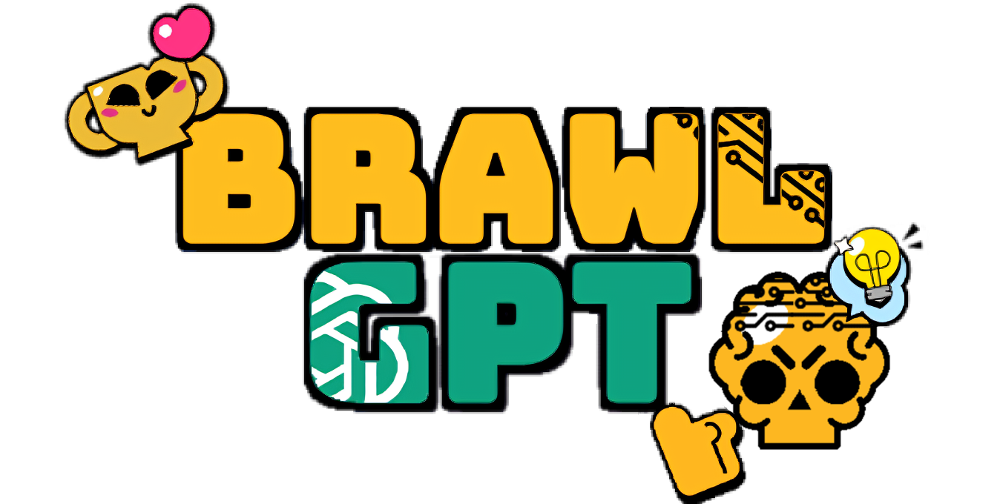

#  BrawlGPT Draft API

<div align="center">
  
</div>

Este proyecto trata de la creación de una API que dado un 🔶 **draft** en Brawl Stars, obtiene la mejor decisión posible utilizando 🔷 **Inteligencia Artificial**.

Incluye la lógica de selección y baneo de brawlers, integración con 🔴 **Gemini AI** para recomendaciones y un sistema modular bien estructurado.<br>  
La idea es usarla para llamarla en una pagina web, la cual también es de código abierto. Esta página recoge la información del draft del usuario de una forma cómoda y atracriva para después llamar a la API y recibir las respuestas de la IA para poder mostrarlas de nuevo en la página en unos pocos segundos. Puedes consultarla en mi perfil o en el botón siguiente.

[](https://github.com/victordiez02/BrawlGPT-App.git)

La motivación de este proyecto es entender el funcionamiento de una API y su creación en Python. Esta es la primera que he creado, con ayuda de la librería 🟢 **FastAPI**.

---

## 🔗 Prueba la API en línea

La API está desplegada públicamente en Render usando un plan gratuito, por lo que puede tardar unos segundos en iniciarse si ha estado inactiva.
Está protegida con una clave de acceso sencilla para evitar abusos en el entorno gratuito.

🛡️ Clave de acceso requerida: 7777777

<div align="center"> <a href="https://brawlgpt-api.onrender.com/docs" target="_blank">  </a> </div>

---

## 💡 **Ejemplo de petición a la API**
👉 **Enviamos estos datos al endpoint `/draft`**
```json
{
  "phase": 2,
  "selected_map": "Hard Rock Mine",
  "banned_brawlers": ["Spike", "Crow", "Rico"],
  "team": "blue",
  "picks": ["Brock"]
}
```
Explicación de los datos enviados:
- **phase**: Fase actual del draft (1-4), que indica en qué etapa se encuentra el proceso de selección de brawlers.
- **selected_map**: El nombre del mapa seleccionado para la partida (por ejemplo, "Hard Rock Mine").
- **banned_brawlers**: Lista de los brawlers baneados por el equipo hasta el momento. En este caso, "Spike", "Crow" y "Rico" son los brawlers baneados.
- **team**: El equipo que realiza el draft ("blue" o "red"). En este caso, el equipo azul.
- **picks**: Lista de los brawlers seleccionados por el equipo hasta el momento. En este caso, el equipo ha elegido a "Brock".

Una vez que estos datos son enviados, se genera un prompt largo que ha sido configurado minuciosamente. Este prompt es procesado por Gemini AI, quien lo evalúa y genera las mejores recomendaciones de brawlers o parejas de brawlers, con su porcentaje de victoria esperada y explicación, tanto en inglés como en español. Las respuestas de Gemini se recogen, se parsean en un formato JSON estructurado y se devuelven a la aplicación para ser tratadas y mostradas.

👉 **Respuesta esperada**
```json
{
  "draft_summary": "Resumen detallado del draft...",
  "gemini_response": {
    "gemini_suggestions": [
        {
            "brawlers": "Maisie + Stu",
            "probability": 75,
            "explanationUSA": "Stu's mobility and damage output are strong, and Max provides support with speed.",
            "explanationESP": "La movilidad y el daño de Stu son fuertes, y Max proporciona soporte con velocidad."
        },
        {
            "brawlers": "Maisie + Rico",
            "probability": 70,
            "explanationUSA": "Good synergy between Maisie and Rico, offering both control and high damage.",
            "explanationESP": "Buena sinergia entre Maisie y Rico, ofreciendo tanto control como alto daño."
        }
    ]
  }
}
```

Explicación de los datos recibidos:
- brawlers: Los brawlers sugeridos o la pareja de brawlers recomendada.
- probability: La probabilidad en porcentaje de éxito de la recomendación, basado en las sinergias y características de los brawlers.
- explanationUSA: Explicación en inglés de por qué se recomienda esta elección.
- explanationESP: Explicación en español de por qué se recomienda esta elección.

---
## 📁 **Estructura del Proyecto**
El código está distribuido en varios módulos para facilitar la **organización** y **mantenimiento**.

📀 **Estructura principal:**
```
📁 app/
 ┗📁 models/         # 📌 Modelos de datos
   ┗ draft_model.py   # ✅ `DraftRequest` (estructura de la API)
 ┗📁 routes/         # 📌 Rutas de la API
   ┗ draft_routes.py  # ✅ Endpoint `/draft`
 ┗📁 services/       # 📌 Lógica del draft y conexión con Gemini
   ┗ draft_service.py # ✅ Lógica del draft (bans, picks, resumen)
   ┗ gemini_service.py # ✅ Comunicación con Gemini AI
 ┗📁 utils/          # 📌 Funciones auxiliares y configuración
   ┗ config.py        # ✅ Carga de datos, consola y prompts
 ┗ main.py            # ✅ Punto de entrada de FastAPI
```

---

## 🔹 **Ubicación de cada función**

### 📌 **1. `app/models/draft_model.py`**
👉 Define la estructura de los datos que recibe la API.

| 📀 Función | 📀 Descripción |
|-----------|--------------|
| `DraftRequest` | Modelo de datos que valida la petición a `/draft`. |

### 📌 **2. `app/routes/draft_routes.py`**
👉 Contiene las rutas de la API (FastAPI).

| 📀 Función | 📀 Descripción |
|-----------|--------------|
| `handle_draft(request: DraftRequest)` | Procesa el draft y obtiene sugerencias de Gemini. |

### 📌 **3. `app/services/draft_service.py`**
👉 Contiene toda la **lógica del draft**.

| 📀 Función | 📀 Descripción |
|-----------|--------------|
| `ban_phase()` | Maneja la fase de baneos. |
| `first_pick_phase()` | Selección del primer pick. |
| `second_third_phase()` | Selección del segundo y tercer pick. |
| `fourth_fifth_phase()` | Selección del cuarto y quinto pick. |
| `last_phase()` | Última selección. |
| `draft()` | Ejecuta el draft hasta la fase indicada. |
| `get_draft_summary()` | Genera un resumen del draft para la IA. |
| `print_draft_summary()` | Imprime el resumen del draft. |
| `execute_draft()` | Genera el resumen del draft y el prompt. |

### 📌 **4. `app/services/gemini_service.py`**
👉 Maneja la conexión con la **API de Gemini**.

| 📀 Función | 📀 Descripción |
|-----------|--------------|
| `call_gemini()` | Envía el prompt a la API de Gemini y obtiene recomendaciones. |
| `parse_gemini_response()` | Convierte la respuesta de Gemini a un JSON estructurado. |

### 📌 **5. `app/utils/config.py`**
👉 Contiene **funciones auxiliares** y **carga de datos**.

| 📀 Función | 📀 Descripción |
|-----------|--------------|
| `clean_console()` | Limpia la consola. |
| `load_data()` | Carga la información de los brawlers. |
| `load_maps()` | Carga los mapas y sus características. |
| `get_team()` | Obtiene el equipo inicial. |
| `get_map()` | Obtiene el mapa seleccionado. |
| `get_phase()` | Obtiene la fase actual. |
| `generate_final_prompt()` | Genera el prompt para la IA. |

### 📌 **6. `main.py`**
👉 Punto de entrada de la API.
- Carga los datos de `brawlers` y `maps`.
- Almacena los datos en `app.state` para usarlos en todas las rutas.
- Registra las rutas con `app.include_router(draft_router)`.

---

## 🚀 **Conclusión**
🔹 Código **modular** y **bien estructurado**.  
🔹 Fácil de **buscar funciones** gracias a este README.  
🔹 **Listo para producción** con FastAPI y Gemini AI.  


## 🚀 **Guía para ejecutar la API en local**

### 1. **Instalar las dependencias**:

Primero, asegúrate de tener un entorno virtual creado. Si no lo has hecho aún, puedes crear uno ejecutando el siguiente comando desde la raíz de tu proyecto:

```bash
python -m venv brawlGPT-env
```

Después, activa el entorno virtual:

- **Windows**:
    ```bash
    brawlGPT-env\Scripts\activate.bat
    ```

- **Unix (Linux/macOS)**:
    ```bash
    source brawlGPT-env/bin/activate
    ```

Una vez dentro del entorno virtual, instala las dependencias necesarias ejecutando el siguiente comando:

```bash
pip install -r requirements.txt
```

### 2. **Iniciar el servidor local**:

Una vez que el entorno virtual esté activado y las dependencias estén instaladas, ejecuta el siguiente comando para iniciar el servidor local utilizando **Uvicorn**:

```bash
uvicorn main:app --reload
```

Esto iniciará el servidor local y podrás acceder a la API en la dirección que se te indique en la consola.

> **💡 TIP:**
> FastAPI genera automáticamente una documentación interactiva para tu API que puedes usar para probarla de forma sencilla, añadiendo "\docs" a tu dirección.

**TEMPORADA 35**

El meta se ha sacado de este video de SpenLC:  
<https://www.youtube.com/watch?v=_aYrn_D-IQU>

Los tiers se han sacado de esta publicación de AshBS:  
<https://www.instagram.com/p/DFiXsv2RceZ/>

La información de mejores picks por mapa se han sacado de este video:  
<https://www.youtube.com/watch?v=S-8mUu3cnWI>

La información de como draftear se ha sacado de este video:  
<https://www.youtube.com/watch?v=YzfE6-v_5a8>

**TEMPORADA 36**

La información de mejores picks por mapa se han sacado de este video de SpenLC:  
<https://youtu.be/kkncne0NAOA?si=89ZSruK3Wid-8LMr>

Los tiers se han sacado de esta publicación de AshBS:  
<https://www.instagram.com/p/DGvuD3BPR4g/>

---

Desarrollado **Víctor Díez**

<div align="center">
  <p><strong>⚠️ Aviso importante</strong></p>
  <p>Este proyecto no está afiliado, respaldado ni patrocinado por Supercell.</p>
  <p>Brawl Stars y sus activos son propiedad de Supercell.</p>
  <p>Para más información, consulta la <a href="https://supercell.com/en/fan-content-policy/">Política de Contenidos de Supercell</a>.</p>
</div>
